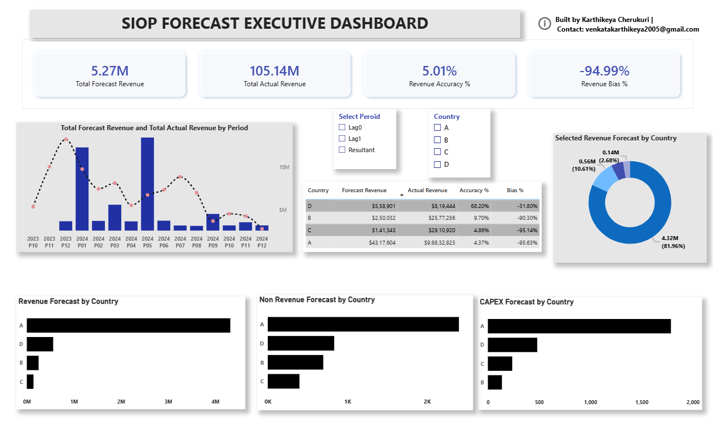

📊 SIOP Forecast Analysis Dashboard (Power BI)

📌 Project Overview

This project focuses on analyzing Sales, Inventory & Operations Planning (SIOP) forecast data using Power BI.
It transforms monthly forecast snapshots into a structured lag-based model to compare forecast evolution over time.

🎯 Objective
Transform multiple forecast snapshots into comparable time-based views
Introduce lag-based forecasting structure (Resultant, Lag 0, Lag 1)
Analyze Revenue, Non-Revenue, and Capex trends
Improve forecast accuracy and bias tracking
Enable executive-level decision-making through dashboards

🔍 Business Insights
Forecast accuracy improves across lag progression
Revenue forecasts show higher stability compared to Capex
Certain regions exhibit consistent forecast bias patterns
Helps identify gaps between planned vs actual performance

⚙️ Data Transformation (Power Query)
Merged multiple forecast snapshot datasets
Created lag-based structure:
Resultant → Latest forecast snapshot
Lag 0 → Previous snapshot
Lag 1 → Older snapshot
Standardized dimensions (Item, Country, Period)
Prepared unified dataset for Power BI modeling

📐 Key KPIs
Forecast Accuracy %
1 - ABS(Lag Qty - Actual Qty) / Actual Qty
Forecast Bias %
(Lag Qty - Actual Qty) / Actual Qty

📊 Dashboard Features
Executive view for Revenue, Non-Revenue, Capex
Country-wise performance analysis
Lag selection filter (Resultant / Lag 0 / Lag 1)
Dynamic KPI comparison across snapshots
Interactive Power BI visualizations

🧰 Tools & Technologies
Power BI
Power Query
Microsoft Excel (.xlsb dataset)

📁 Project Structure

SIOP-Forecast-Dashboard/
│
├── dataset/
├── powerbi/
├── screenshots/
│   └── dashboard.png
├── README.md

🚀 Key Outcome

Built a scalable forecasting analytics model that enables multi-snapshot comparison, improves visibility of forecast accuracy, and supports strategic business planning.